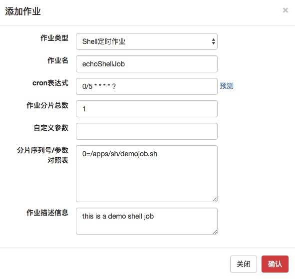
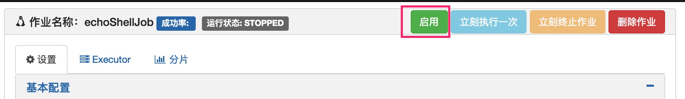

# Saturn作业开发指引之Shell作业

Shell作业实际上不局限于Shell脚本，还可以是一切能在Executor所在服务器运行的脚本和程序，脚本/程序的开发语言不受限制，可以使Python/Java/PHP/Ruby …。

具体原理见下图。在满足调度条件时，Saturn Executor会调用System.exec()去调用脚本/程序。


## 1 开发第一个Shell作业 ##

开发Shell作业有两种形式：

* 脚本直接在Console添加作业的过程中输入，无须在Executor防止任何脚本。这适合一些简易的脚本。
* 脚本/程序放置在某特定路径上。

下面介绍用第2种方式写一个Shell作业。

首先，我们先准备好脚本，名字为**demojob.sh**，放置在/apps/sh/目录下。脚本内容：

```shell
#/bin/sh
echo "hello world"
```

修改权限：

```shell
chmod +x /apps/sh/demojob.sh
```

## 2 启动Executor

下载并启动一个Executor。详情参见[Saturn Executor部署指南](zh-cn/2.x/saturn-executor-deployment.md).

## 3 在Console添加Shell作业，并启动

当Executor启动后，作业还是不会被执行，直到在Console添加和启动相应的Shell作业。

在Console添加一个Shell作业。



留意分片参数。参数的值是执行/apps/sh/demojob.sh脚本的命令。

并启动这个作业



如果一切正常会在IDE的console看到作业运行的日志，也可以在“分片”标签看到执行的结果。（当然，前提是作业到点执行了）

下面是执行成功看到的日志：

```
[2017-12-13 17:17:25.119] [INFO] [Saturn-echoShellJob-2-thread-2] [com.vip.saturn.job.shell.ScriptJobRunner] >>> [echoShellJob] msg=echoShellJob-0: hello world

[2017-12-13 17:17:25.120] [INFO] [Saturn-echoShellJob-2-thread-2] [com.vip.saturn.venus.util.HemersCounter] >>> msg=reported event to herms, type:SATURN.EXECUTOR.FOR.NABOO, title:Job item stop, jobName is echoShellJob, item is 0, msg:executorName is executor_001, domain is yfb-saturn-executor.vip.vip.com
[2017-12-13 17:17:25.120] [INFO] [executor_001_echoShellJob-saturnQuartz-worker] [com.vip.saturn.job.basic.AbstractSaturnJob] >>> [echoShellJob] msg=echoShellJob finished, totalCost=24ms, return={0=SaturnJobReturn [returnCode=0, returnMsg=the exit value is 0, errorGroup=200, prop={}]}
```

下面是Console看到的结果：


至此，你的第一个Shell作业已经顺利开发完成！