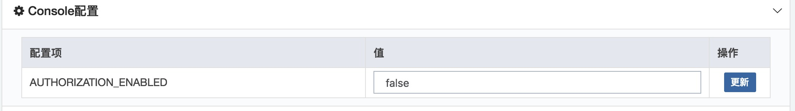
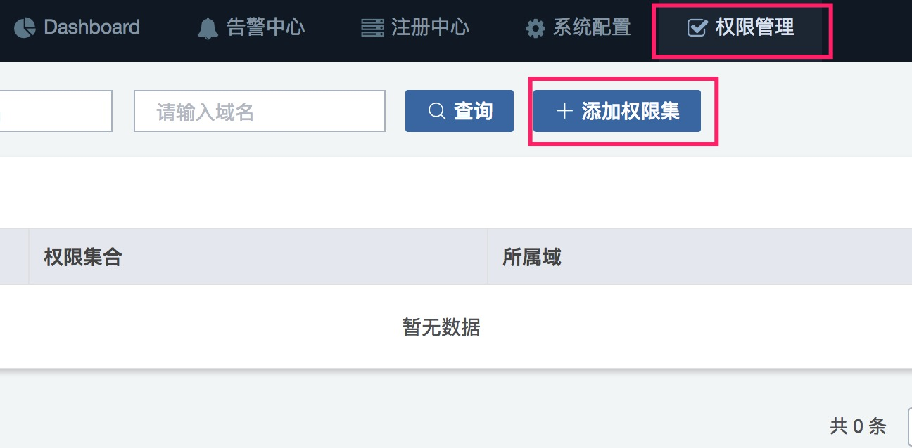

# 用户的认证与授权

从3.0.1起，Saturn Console支持用户的认证与授权。

## 1 认证 

Saturn3.0.0开始，Console支持用户登录认证。但用户注册功能不在Scope里面，这意味着用户注册需要用户自行实现。

### 1.1 启用认证功能

Console默认不启用认证功能。如果要启用，请在启动console添加参数 -Dauthentication.enabled=true

系统默认添加了2个用户以作demo之用：

| Username | Password |
| -------- | -------- |
| admin    | admin    |
| guest    | guest    |

### 1.2 支持的认证方式

Saturn当前支持2类认证手段：明文(plaintext)和PBKDF2WithHmacSHA1.

可以通过设置JVM property “-Dauthentication.hash”改变算法，**默认是plaintext(明文)**。如果authentication.hash非上述2种，会返回异常。

> 注意，明文仅作测试用途，不建议上生产。

### 1.3 用户密码与格式

在定制用户注册功能时，请务必保证用户信息持久化到数据库的user表里面。其中，password字段用于保存密码。

密码存储格式需要结合认证的方式。

如果是明文认证，则password存放的是明文。 

如果是使用PBKDF2WithHmacSHA1，则格式为：

`<code1>$<code2>`

- code1: 使用PBKDF2WithHmacSHA1生成的密码在经过hex encode后的值
- code2: 盐经过hex encode后的值
- $ 为code1和code2的分隔符

### 1.4 用户注册功能实现

实现用户注册时，可以使用com.vip.saturn.job.console.utils.PasswordUtils.genPassword(password, salt, algorithm)或者com.vip.saturn.job.console.utils.PasswordUtils.genPassword(password, algorithm)方法生成密码，并持久化到数据库。其中，password是明文密码，salt是盐，algorithm即上面提到的算法。

## 2 授权

### 2.1 启用授权功能

Console默认不启用授权功能。如果要启用，请在启动console添加参数 -Dauthorization.enabled.default=true

在console启动后，你可以在系统配置动态禁用/启用授权功能（无须重启console）。

### 2.2. 权限与权限集（角色）

Saturn为不同的操作设定了不同的权限，同时设定了3个权限集（角色），如下表所示。Saturn目前不提供添加/修改/删除权限和权限集的功能。

| 权限                             | 所属权限集合                 |
| -------------------------------- | ---------------------------- |
| 作业启停（批量/单个作业）        | 系统管理，域管理，域开发管理 |
| 立即执行/立即终止                | 系统管理，域管理             |
| 作业添加（批量/单个作业）        | 系统管理，域管理             |
| 作业设置更新                     | 系统管理，域管理             |
| 作业删除（批量/单个作业）        | 系统管理，域管理             |
| 作业导入/导出                    | 系统管理，域管理             |
| 批量作业优先                     | 系统管理，域管理             |
| 设置告警已阅                     | 系统管理，域管理             |
| 重启单个executor                 | 系统管理，域管理             |
| Executor监控（dump/重启/摘流量） | 系统管理，域管理             |

> 注意，域管理权限是针对单个域，而系统管理是针对所有域。

### 2.3 添加用户权限

为用户添加权限，进入“权限管理”页面，点击“添加权限集”按钮。

