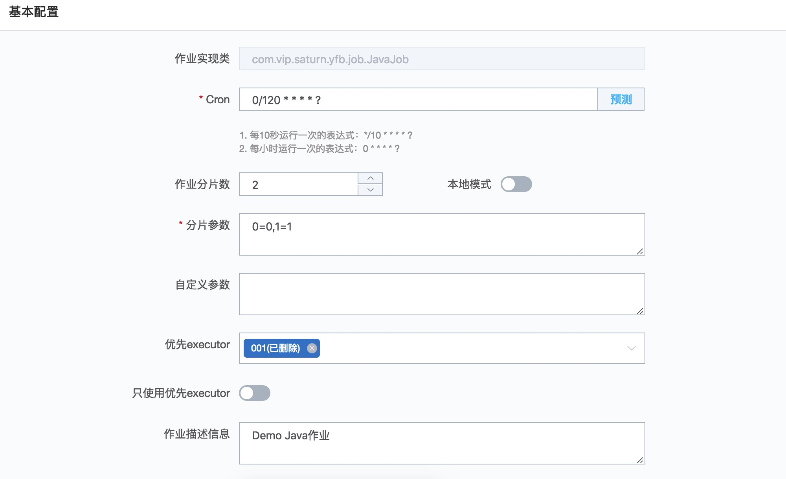
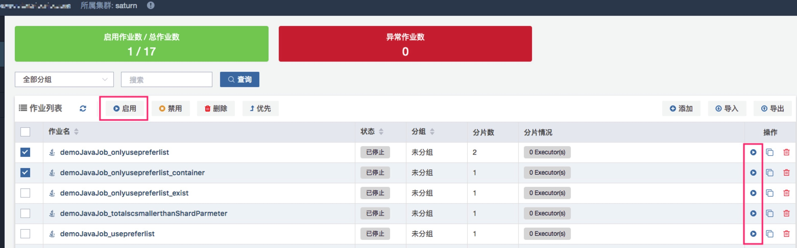
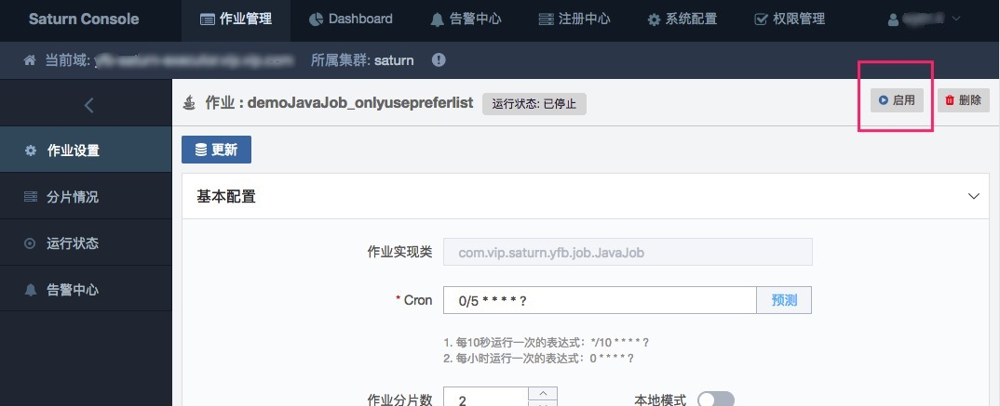

# 创建作业

## 1 登录

使用浏览器访问 saturn.vip.vip.com。如果启用了登录功能(-Dauthentication.enabled=true)，会被重定向到CAS进行身份认证。

> 为了获得最佳的使用体验，建议使用Chrome浏览器。

登录后会见到Saturn Home Page，如下：


用户需要在中央的搜索框输入你需要访问的域名。

首页上方的菜单栏功能如下：

- 作业管理：域搜索页面
- Dashboard：作业/Executor运行状况图表
- 告警中心：全域的告警大盘。
- 注册中心：域与ZK集群信息一览。
- 系统配置：系统参数设置。

> 如果启用了授权功能，由于权限的原因部分菜单你可能看不到。

## 2 作业总览

在Home page输入你的域名，然后点击进入。如果没有找到你的域名，请先添加域。


1. 作业总览：如截图所示，显示域下所有作业及状态，同时提供一些操作。

2. Executor总览：看到域下所有executor信息。

3. 告警中心：列出该域相关的所有告警

4. 作业名：作业名前面会根据不同的类型显示不同的图标。上面为例，0326shell为Shell作业，demoJavaJob为Java作业。

5. 作业状态，描述如下：

   - **已就绪**：作业已经启用，但是不在运行状态。

     如果设置了上报运行状态（非秒级作业默认上报），"已就绪"表示作业尚未到运行时间。如果没有上报运行状态，"已就绪"仅表示作业已被启用，并不知晓其是否正在运行。

     > 上报运行状态：Executor上报作业的运行状态开关。具体见下面的“详细作业设置”章节

   - **运行中**：作业正在运行中。

   - **已停止**：作业被停用，而且没有处于运行状态。

   - **停止中**：作业被停用，但作业正处于运行中。运行完毕后会改为“已停止”状态。

6. 作业分组：为了管理方便，可以对作业进行分组。如何分组将在“详细作业设置”描述。

7. 分片情况：显示作业分片给多少个不同的executor，executor可以是容器，也可以是物理机。鼠标移至图标可以看到详细的executor name。

8. 单个作业的禁用和复制操作：依次为**禁用操作**图标和**复制操作**图标。

   如果一个作业已经被启用，则你可以禁用它。

   > 要注意，禁用作业不代表作业会立即终止，默认情况下会等待此次执行完成，如果想立即终止，需要进入作业详细设置页面，点击“立即终止”。

9. 作业操作按钮bar，依次为：

   - 批量启用：批量选择处于“已停止”状态的作业，进行启用。

   - 批量禁用：批量选择启用（包括处于已就绪和运行中状态）的作业，进行禁用。

   - 批量删除：批量删除处于“已停止”状态的作业。

   - 批量优先（Executor）：如果你想选择特定的executor去运行你的作业，则需要设置优先executor。下拉框的候选项为当前域下的所有executor。

      > 注意，在优先executor(s)还是online的情况下，Saturn是不会安排作业运行到其他没有成为优先的executor中去，除非所有优先executor都offline。

   - 添加（单个作业）：快速添加单个作业。

   - 导入（作业）：预先将作业配置定义到excel中去（模板在弹出窗口中提供），然后利用此功能上载此excel完成批量导入。

   - 导出（作业）：将域下所有作业的配置导出到excel中。

      > Tips：如果希望把测试环境的作业全量转移到生产环境中去，只需要在测试环境导出一个excel，然后导入到生产环境即可。

10. 搜索作业：按照作业名搜索你的作业。

11. 异常作业总览：显示域下异常作业的数量，点击会进入告警中心。

12. 单个作业的启用和删除操作：如果作业处于“已停止”状态，则可以通过启用按钮进行启用，或者使用“删除”功能进行删除。

## 3.添加你的作业

添加作业，有三种不同的方式：创建全新的作业，从xls导入你的作业，或者复制一个已有的作业。

#### 3.1 创建全新的作业

点击作业总览里面的"添加"按钮，你可以添加不同类型的作业。当前支持2类作业：Java定时作业和Shell定时作业。

##### 3.1.1 创建Java定时作业


- 作业名：全域唯一的作业名。

- 作业实现类：Java作业代码的实现类。

- 分片总数：同一作业可以分成多个分片进行并发调度。分片总数默认是1。

- cron表达式：基于Quartz的cron表达式，官方教程见[这里](http://www.quartz-scheduler.org/documentation/quartz-2.x/tutorials/crontrigger) ，中文教程看[这里](http://www.blogjava.net/fancydeepin/archive/2012/06/12/quartz-cron.html)。可以点击“**预测**”按钮检查自己的Cron是否正确。

- 分片参数：分片序列号和参数用等号分隔，多个键值对用逗号分隔 。分片序列号从0开始，不可大于或等于作业分片总数。如：0=a,1=b,2=c; 英文双引号请使用!!代替，英文等号请使用@@代替，英文逗号请使用##代替。

  如果作业所有分片无须参数，则只要保持值为0。例如有2个分片无须参数，则为“0=0”。
  对于本地模式的作业，格式为*=value。关于本地模式的介绍，见“作业详细设置”章节。

##### 3.1.2 创建Shell定时作业

Saturn对编程语言的支持理论上是没有限制的。对于非Java的作业，请使用Shell类型作业去进行构建。

Shell类型作业的参数基本上跟Java定时作业一致。下面是2个例子。

**Shell script**

如果你要运行一个名字为“helloworld.sh”的shell脚本，可以在分片参数中设置如下。其中，some_folder是你脚本在executor的目录。

```Shell
0=/bin/sh some_folder/helloword.sh
```

**Linux Command**

```
0=echo 'hello world'
```

**PHP**

```
0=php helloworld.php
```

#### 3.2 导入作业

见“作业总览”章节的 “导入（作业）”和“导出（作业）”的介绍。

一种常见的使用场景是把不同环境之间的批量作业迁移。

#### 3.3 复制作业

从现有作业复制出一个新的作业。

见“作业总览”章节的 “单个作业的禁用和复制操作”的介绍。

## 4.详细作业设置

点击作业设置，会看到更多的作业配置参数。

#### 4.1 Java作业详细设置



- 自定义参数：在分片序列号/参数对照表中可作为alias形式引用，格式为{key1}；作业实现类可以通过SaturnJobExecutionContext#getJobParameter方法获取。

  配置格式: 多个配置使用逗号分隔(key1=value1, key2=value2)。

- 优先Executor：如果你想选择特定的物理机executor去运行你的作业，则需要设置优先executor。下拉框的候选项为当前域下的所有在线的executor。

  > 注意，在优先executor(s)处于online的情况下，Saturn是不会安排作业运行到其他没有成为优先的executor中去，除非所有优先executor都offline。

- 只使用优先Executor：如果优先executor离线了，不会failover到其他机器。

- 本地模式：有一些定时任务（比如定时清理本机日志，定时更新本地配置等）要求能够定时执行，并且只能由一个进程（线程）执行；当不断有新机器加入时，新加入的机器可以自动参与定时执行；当有机器下线时，不需要其它机器来接管它的任务，不需要失败转移。这类任务（作业）往往与本地操作有关，我们之为**本地模式**的作业。


- 超时告警：超过此阈值则发送告警(告警只提供接口，每个使用者均需要自行实现告警逻辑)。0代表不设置（默认）。

- 超时强杀：超过此阈值则被强杀。0代表不设置（默认）。

- 作业负荷：Saturn Executor 作业分片调度算法的核心思想是尽量保证全域的executor负荷平均。而Executor的负荷等于所有作业的分片乘以负荷的加权。简单来说，如果你希望作业占用更多的资源（Executor），则将次负荷设置为一个大的数字。

- 统计处理间隔：Executor周期性上报一些统计数据到Console，此设置项设置此周期的大小。

- 控制台输出日志：启用后所有作业打印到console的日志都会在这里显示。默认不启用。建议仅在作业调试时使用。因为大量日志会对ZK性能有影响。

- 上报运行状态：如果此功能启用，executor会将作业是否正在运行或已经运行完成的状态上报到ZK。对于定时作业（包括Java和Shell），如果调度频率高于5秒，则会默认上报，否则不上报。对于消息作业，默认不上报。

- 依赖作业：假设作业A依赖作业B，如果此功能启用，有两种情况会收到提醒：

  - A和B未被启用，当用户想启用A时，会提醒用户所依赖的作业（即B）未被启用；

  - A和B正在启用，当用户想禁用B时，会提醒用户有作业依赖于B是否还是继续禁用；

    此功能默认不开启。

- 暂停日期段：在此日期内作业不运行。支持多个日期段，逗号隔开。例如03/12-03/15,11/23-12/25。当日期为空，时间段不为空，表示每天那些时间段都暂停

- 暂停时间段：在此时间段内作业不运行。支持多个时间段，逗号隔开。例如12:23-13:23,16:00-17:00。当日期为不空，时间段为空，表示那些日期段24小时都暂停

#### 4.2 Shell作业详细设置

描述与上面Java作业详细设置一致。

## 5. 启用作业

添加作业后，需要被启用才能被executor执行。

启用作业的方式有下面几种：

- 在作业预览页面批量启用或者启用单个作业，如下图：

  

- 在作业操作栏启用作业，如下图：

