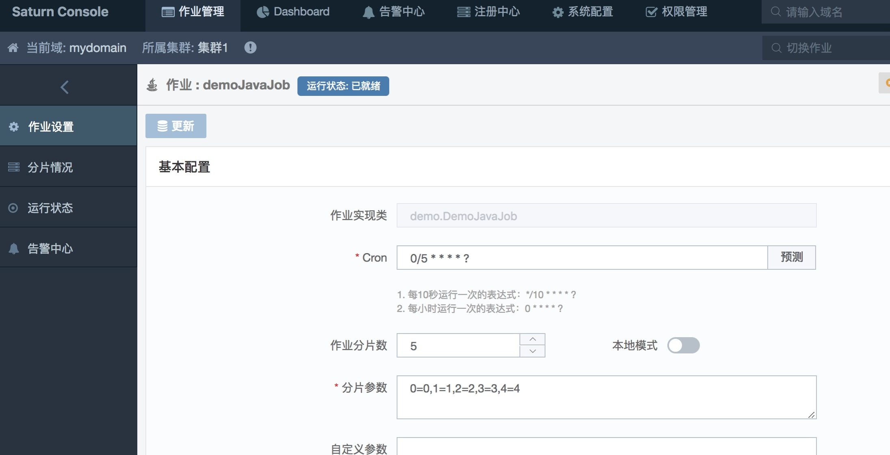

# 快速开始
Saturn包括两大部分，**Saturn Console**和**Saturn Executor**。

Saturn Console是一个GUI，用于作业/Executor管理，统计报表展现，系统配置等功能。它同时也是整个调度系统的大脑：将作业任务分配到各Executor。

Saturn Executor是执行任务的Worker：按照作业配置的要求去执行部署于Executor所在容器或物理机当中的作业脚本和代码。

为了能让用户对Saturn有一个感性认识，我们提供了两种快速启动Console和Executor的方法。

至于生产环境的部署，请参见后面的部署指南。

## 1 一键启动

首先，请确保本机安装了以下软件：

* JDK 7 or JDK 8
* Maven 3.0.4+
* node.js 8.7.0+
* npm 5.4.2+
* docker (版本不限)

然后，git clone本仓库到本地，checkout对应版本分支，进入`quickstart`目录。如果是Windows系统，请运行`quickstart.bat`，如果是Linux/Unix/MacOS系统，请运行`quickstart.sh`。

```
$ git clone https://github.com/vipshop/Saturn
$ git checkout develop
$ cd saturn-docker
$ chmod +x quickstart.sh
$ ./quickstart.sh
```

quickstart脚本将做如下事情：
* 启动内嵌的ZooKeeper
* 启动内嵌的Saturn-Console
* 启动内嵌的Saturn-Executor（包含了一个Java作业的实现）
* 在Saturn-Console添加该Java作业

启动完成后，您可以访问Saturn-Console：[http://localhost:9088](http://localhost:9088)

如果你见到如下界面，则恭喜你，你的console已经启动。


在首页的search bar点击会出现一个叫做'mydomain'的namespace。点击进去会见到一个名为'demoJavaJob'的作业，该作业有5个分片，每隔5秒调度一次。




一个叫做'executor-1'的executor执行器调度该作业。

## 2 Docker启动

```
$ git clone https://github.com/vipshop/Saturn
$ git checkout develop
$ cd saturn-docker
$ chmod +x quickstart-docker.sh
$ ./quickstart-docker.sh
```

quickstart-docker.sh脚本将做如下事情：
* 构建基于OpenJDK7的基础镜像
* 构建基于OpenJDK7的Saturn-Console镜像
* 构建基于OpenJDK7的Saturn-Executor镜像
* 启动一个ZooKeeper集群的容器
* 启动一个Saturn-Console容器
* 启动两个Saturn-Executor容器
* 添加一个Java作业和一个Shell作业

启动成功后，您可以访问Saturn-Console：[http://localhost:9088](http://localhost:9088)
