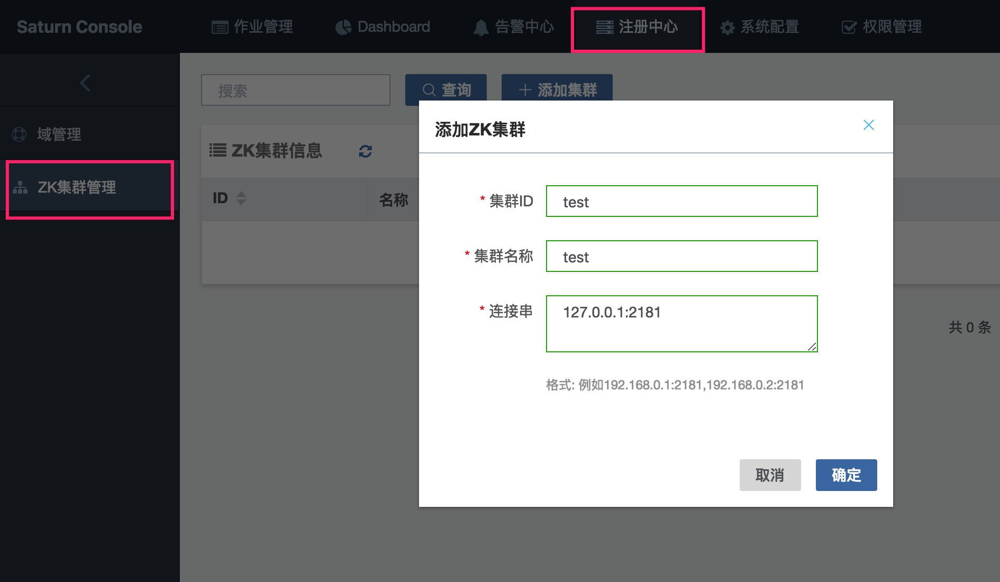
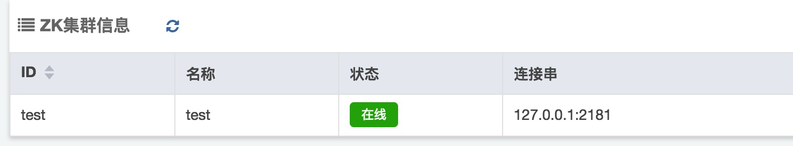

# Saturn Console部署

这一节会介绍如何从零开始安装和部署Saturn Console。

## 1 部署前准备

### 1.1 硬件准备

Linux服务器至少1台，服务器数量视乎计划的Saturn Console的集群及ZK集群的大小。

### 1.2 软件准备

JDK  >= 1.7

ZooKeeper >= 3.4.6 （建议使用ZooKeeper 3.4.6 ([官网下载链接](https://archive.apache.org/dist/zookeeper/zookeeper-3.4.6/))，更高版本未经验证）

## 2 开始部署

### 2.1 安装ZooKeeper

按照官方文档进行安装。

对于生产环境，推荐使用5台服务器组成的集群（1 Leader + 4 Follower）。

推荐的ZooKeeper配置参看**这里**。

### 2.2 安装MySQL

当前Saturn支持2个数据库：MySQL和H2。H2主要用于测试，生产环境推荐使用MySQL。MySQL主要用于存储作业配置及配置历史，系统配置，以及namespace及zk集群信息等等。

关于MySQL的版本，没有任何要求。

安装MySQL，遵循MySQL的官方文档进行这里不作说明。

### 2.3 数据准备

下面操作是针对MySQL，对于H2可以仿照类似的做法。

#### 2.3.1 database创建

数据库的名字可以自行指定。下面是个例子：

```mysql
CREATE DATABASE saturn CHARACTER SET utf8 COLLATE utf8_general_ci;
```

#### 2.3.2 schema创建

从[这里](https://github.com/vipshop/Saturn/blob/develop/saturn-console/src/main/resources/db/mysql/schema.sql)获取最新的**schema.sql**。如果希望获得其他版本的schema，可以在源代码的其他tag上获取。

执行schema.sql。

### 2.4 安装Console

#### 2.4.1 下载

从<https://github.com/vipshop/Saturn/releases> 中点击最新版本的“Console Zip File”，下载得到saturn-console-{version}-exec.jar，将之放到合适的目录。

> 本教程以3.x为例。

#### 2.4.2 启动Console

```shell
nohup java -DSATURN_CONSOLE_DB_URL=jdbc:mysql://localhost:3306/saturn -DSATURN_CONSOLE_DB_USERNAME=your_username -DSATURN_CONSOLE_DB_PASSWORD=your_password -jar saturn-console-{version}-exec.jar &
```

访问http://{ip}:9088 即可看到saturn控制台。其中ip指的是console安装的机器的IP。

日志会输出到路径/apps/logs/saturn_console/saturn.console.log

##### 2.4.2.1 JVM参数推荐

注意，如果是在生产环境启动console，建议增加一些JVM启动参数：

JDK 1.7:

```shell
-Xmx2G -Xms2G -XX:PermSize=256m -XX:MaxPermSize=512m -XX:+UseConcMarkSweepGC -XX:+UseCMSInitiatingOccupancyOnly -XX:CMSInitiatingOccupancyFraction=75 -XX:+ExplicitGCInvokesConcurrent -Xloggc:${HOME}/gc_zk.log -XX:+PrintGCDetails -XX:+PrintGCDateStamps -XX:ErrorFile=${HOME}/hs_err_%p.log -XX:+HeapDumpOnOutOfMemoryError -XX:HeapDumpPath=${HOME}
```

JDK 1.8:
```shell
-Xmx2G -Xms2G -MetaspaceSize=256m -MaxMetaspaceSize=512m -XX:+UseConcMarkSweepGC -XX:+UseCMSInitiatingOccupancyOnly -XX:CMSInitiatingOccupancyFraction=75 -XX:+ExplicitGCInvokesConcurrent -Xloggc:${HOME}/gc_zk.log -XX:+PrintGCDetails -XX:+PrintGCDateStamps -XX:ErrorFile=${HOME}/hs_err_%p.log -XX:+HeapDumpOnOutOfMemoryError -XX:HeapDumpPath=${HOME}
```

##### 2.4.2.2 启动参数描述

| 参数名                                      | 是否支持环境变量/JVM参数 | 描述                                | 是否必须 |
| ---------------------------------------- | -------------- | --------------------------------- | ---- |
| VIP_SATURN_CONSOLE_CLUSTER               | 都支持            | Console集群id                       | N    |
| SATURN_CONSOLE_DB_URL                    | 都支持            | DB 连接url                          | Y    |
| SATURN_CONSOLE_DB_USERNAME               | 都支持            | DB用户名                             | Y    |
| SATURN_CONSOLE_DB_PASSWORD               | 都支持            | 密码                                | Y    |
| saturn.console.log     | JVM参数(-D)   | 日志目录。默认是/apps/logs/saturn_console | N    |
| VIP_SATURN_DASHBOARD_REFRESH_INTERVAL_MINUTE | 都支持            | Dashboard后台刷新频率，单位是分钟。默认值是1。      | N    |
| server.port | JVM参数(-D)       | 启动端口，默认9088      | N    |
| authentication.enabled | JVM参数(-D) | 是否启用用户认证。默认为false。详情参阅认证和授权一节 | N |
| authorization.enabled.default | JVM参数(-D) | 是否默认启用用户鉴权。默认为false。详情参阅认证和授权一节 | N |

使用浏览器访问 http://localhost:9088 即可看到你的Saturn Console！

#### 2.4.3 创建ZK集群

Executor会从ZK获取相应域的作业信息，并上报作业的运行状态到ZK。而一个Console（集群）可以管理多个ZK集群。下面会介绍如何在Console添加zk集群。假设我们要添加的zk集群id为test。

##### 2.4.3.1 在系统配置绑定console与zk集群

在“系统配置”处的CONSOLE_ZK_CLUSTER_MAPPING，绑定console和zk集群，格式为{console_id}:{zk_cluster_id}。如果console启动没有指定VIP_SATURN_CONSOLE_CLUSTER，则使用default。


##### 2.4.3.2 创建zk集群

点击“注册中心菜单”，点击“ZK集群管理”子菜单里面的“添加集群”按钮。输入ZK信息，如下：



添加完成后，会看到zk在线。



#### 2.4.4 创建域

域是多个作业的管理单元，域与zk集群进行绑定，两者是多对一的关系。一个域只从属于一个zk集群。

在注册中心的“域管理”页面，添加域(namespace), 同时与zk cluster绑定。


创建完域，下一章会告诉你，如何创建一个Java作业。

### 2.5 关于Console的集群部署

为了实现Console的高可用性，我们都希望Console有多台服务器所组成。我们只需要在多台不同的服务器的环境变量中指定相同的VIP_SATURN_CONSOLE_CLUSTER即可，至于VIP_SATURN_CONSOLE_CLUSTER的值，由你自行指定，只是一个集群标识而已。

