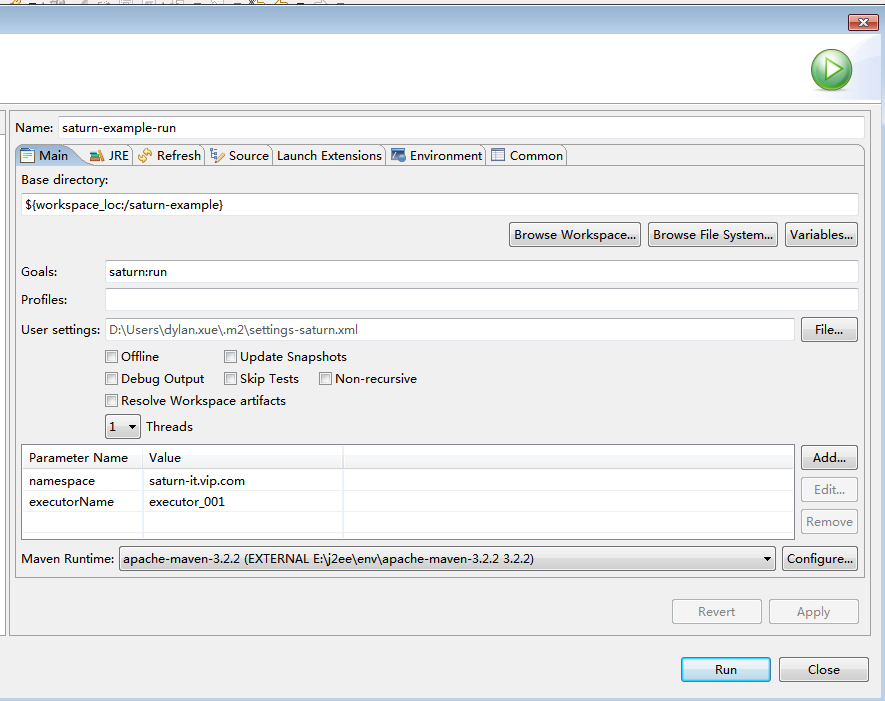
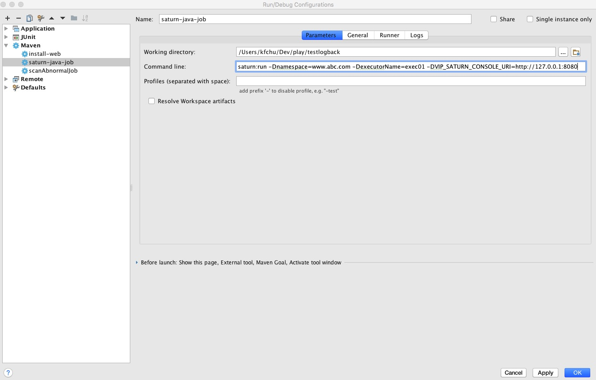

# Saturn作业开发指引之Java作业

这一节想介绍如何写一个简单的Java作业，并使用你熟悉的IDE进行调试。

> 但要注意的是，作业开发完需要将其部署到Executor才能真正的工作。关于如何部署，见“部署 Saturn Executor”一节。

## 0 前置条件

确保你已经部署好Saturn Console。如果没有，请参见“部署Saturn Console”一节。

## 1 添加maven依赖

在pom.xml添加dependency

```xml
<dependency>
    <groupId>com.vip.saturn</groupId>
    <artifactId>saturn-job-api</artifactId>
    <!-- 修改成指定版本 -->
    <version>master-SNAPSHOT</version>
</dependency>  
```

以及plugin

```xml
<plugin>
  <groupId>com.vip.saturn</groupId>
  <artifactId>saturn-plugin</artifactId>
  <!-- 版本与saturn-job-api一致 -->
  <version>master-SNAPSHOT</version>
</plugin>
```

## 2 开发第一个Java作业 ##

修改现在类或者增加一个新的类，继承自**AbstractSaturnJavaJob** ，实现 *handleJavaJob*方法。

```java
    public class DemoJob extends AbstractSaturnJavaJob {

    	@Override
    	public SaturnJobReturn handleJavaJob(final String jobName, final Integer shardItem, final String shardParam, final SaturnJobExecutionContext context) {
    	// do what you want here ...
              
    	// 返回一个SaturnJobReturn对象，默认返回码是200表示正常的返回
            		return new SaturnJobReturn("我是分片"+shardItem+"的处理结果");
	    }
    }
```

handleJavaJob方法是作业调用主入口，当调度周期到达时，Saturn会调用该方法。

传入参数如下：

* jobName：作业名
* shardItem：分片编号（从0开始）分片参数（在Console配置)
* shardParam：分片参数（在Console配置）
* context：调用上下文

上面只是展示了如何写一个简单的作业，实际上的作业会复杂很多，**AbstractSaturnJavaJob**提供的一些工具方法或许会减少你的工作量。更多的**AbstractSaturnJavaJob** 的方法介绍可以看教程。

#### 关于JavaJobReturn

JavaJobReturn是作业结果返回的封装。里面三个成员变量，包括：

- returnCode: 结果码。0代表结果成功，其余值代表失败。默认为0。用户可以根据自己业务的情况设置返回值，但注意，如下返回码是保留字不能使用，包括：0，1，2，9999。
- returnMsg：返回信息。将显示在Console里面。没有默认值。
- errorGroup：异常码。详情参见教程。

## 3 在IDE中调试作业

这一步会在IDE启动一个Executor进程。

### 3.1 Eclipse

点工程右键 -> Run/Debug As -> Run Configuration 



- namespace： 命名空间。命名空间用于对作业进行分组，作业必须属于某个命名空间，同一个命名空间下的作业名不能重复。
- executorName：执行结点唯一标识

### 3.2 IntelliJ IDEA


添加启动参数:

saturn:run -Dnamespace=www.abc.com -DexecutorName=exec01 -DVIP_SATURN_CONSOLE_URI=http://127.0.0.1:9088

参数含义请参考3.1节

## 4 在Console添加Java作业

当IDE启动了Executor后，作业还是不能执行，直到在Console添加和启动相应的Java作业。

在Console添加一个Java作业，**作业实现类**必须是你所实现的Java作业的className。


* 作业类型： 分为Java定时作业和Shell定时作业，这里选择Java定时作业
* 作业名：作业ID标识，namespace下必须唯一
* 作业实现类：作业实现类的完整包名+类名
* cron表达式：作业定时表达式
* 作业分片总数：表示并发执行的数量，2代表该作业同时有两个进程在并发执行，每个进程都有自己专门的脚本和参数(这些进程可能同跑在不同机器上的)。
* 分片序列号/参数对照表：定义每个分片执行的完整脚本路径及参数。这是saturn最重要的参数之一。分片号从0开始，最大为分片总数-1。
* 作业描述信息 (*Optional*)：作业描述

更多高级的配置，可以在作业编辑页面进行编辑。

然后启动这个作业


如果一切正常会在IDE的console看到作业运行的日志，也可以在“分片”标签看到执行的结果。（当然，前提是作业到点执行了）

下面是执行成功看到的日志：

```
[2017-12-13 15:09:45.206] [INFO] [executor_001_echoJavaJob-saturnQuartz-worker] [com.vip.saturn.job.basic.AbstractSaturnJob] >>> [echoJavaJob] msg=Job echoJavaJob handle items: [0, 1]
[2017-12-13 15:09:45.206] [INFO] [Saturn-echoJavaJob-1-thread-1] [com.vip.saturn.job.java.SaturnJavaJob] >>> [echoJavaJob] msg=Running SaturnJavaJob,  jobClass is com.test.DemoJob 
[2017-12-13 15:09:45.207] [INFO] [Saturn-echoJavaJob-1-thread-3] [com.vip.saturn.job.java.SaturnJavaJob] >>> [echoJavaJob] msg=Running SaturnJavaJob,  jobClass is com.test.DemoJob 
[2017-12-13 15:09:45.207] [INFO] [executor_001_echoJavaJob-saturnQuartz-worker] [com.vip.saturn.job.basic.AbstractSaturnJob] >>> [echoJavaJob] msg=echoJavaJob finished, totalCost=1, return={0=SaturnJobReturn [returnCode=0, returnMsg=我是分片0的处理结果, errorGroup=200, prop={SATURN_TRACE_ID=4882587783541623202, SATURN_PARENT_SPAN_ID=1611817686233844130}], 1=SaturnJobReturn [returnCode=0, returnMsg=我是分片1的处理结果, errorGroup=200, prop={SATURN_TRACE_ID=4418419319829081425, SATURN_PARENT_SPAN_ID=3024241466322103633}]}
```

下面是Console看到的结果：


## 5 打包&部署 ##

如果上述步骤没有问题，则意味着作业在本地验证通过。现在可以进行部署了。

运行以下命令打包

```Shell
mvn saturn:zip
```

会在/target目录下得到**-app.zip**的一个压缩包，参照部署指引将压缩包部署到executor。

当你走完这一步，你的作业已经开发并调试完毕，请参见“部署Saturn Executor”一节，了解如何把打包好的作业部署到Executor运行。