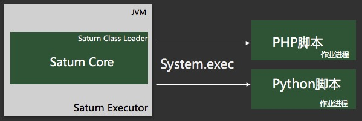
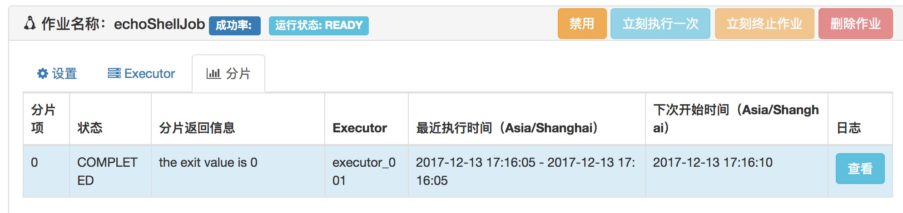

# 开发Shell作业

Shell作业实际上不局限于Shell脚本，还可以是一切能在Executor所在服务器运行的脚本和程序，脚本/程序的开发语言不受限制，可以使Python/Java/PHP/Ruby …。

具体原理见下图。在满足调度条件时，Saturn Executor会调用System.exec()去调用脚本/程序。



## 0 前置条件

确保已经部署好Saturn Console，部署方法请参见“**安装Saturn Console**”一节。

## 1 开发第一个Shell作业 ## 

开发Shell作业有两种形式：

* 简易开发：直接在Saturn Console文本框中编写Shell脚本，无需在Executor放置脚本，该方法适合运行简易的脚本
* 脚本开发：把脚本/程序部署在特定路径上，然后在Saturn Console上配置脚本运行路径

根据实际需求选择任意一种方式新建Shell作业

### 1.1 简易开发 ###
首先通过首页进入默认域（或自定义域）


然后点击“添加”按钮添加新作业


接着添加Shell作业，在“分片参数”输入框中输入Shell脚本


最后点击“确定”保存

### 1.2 脚本开发 ###
您还可以选择脚本来开发Shell作业。

首先准备脚本，在/apps/sh目录下新建**demojob.sh**脚本，脚本内容：

```shell
#/bin/sh
echo "hello world"
```

然后给脚本新增可执行权限：

```shell
chmod +x /apps/sh/demojob.sh
```
脚本准备完后添加Shell作业


留意分片参数配置，参数的值是执行/apps/sh/demojob.sh脚本的命令。

最后点击“确定”保存。

## 2 启动Executor

下载并启动一个Executor。详情参见[Saturn Executor部署指南](zh-cn/2.x/saturn-executor-deployment.md).

对于Shell作业，Executor的部署比Java作业要简单，只要下载并解压，执行脚本的启动命令即可。

## 3 启动作业

当Executor启动后，作业不会自动执行，直到在Saturn Console启动相应的Shell作业。


如果一切正常会在IDE的console看到作业运行的日志，也可以在“分片”标签看到执行的结果。（当然，前提是作业到点执行了）

下面是执行成功看到的日志：

```
[2017-12-13 17:17:25.119] [INFO] [Saturn-echoShellJob-2-thread-2] [com.vip.saturn.job.shell.ScriptJobRunner] >>> [echoShellJob] msg=echoShellJob-0: hello world

[2017-12-13 17:17:25.120] [INFO] [Saturn-echoShellJob-2-thread-2] [com.vip.saturn.venus.util.HemersCounter] >>> msg=reported event to herms, type:SATURN.EXECUTOR.FOR.NABOO, title:Job item stop, jobName is echoShellJob, item is 0, msg:executorName is executor_001, domain is yfb-saturn-executor.vip.vip.com
[2017-12-13 17:17:25.120] [INFO] [executor_001_echoShellJob-saturnQuartz-worker] [com.vip.saturn.job.basic.AbstractSaturnJob] >>> [echoShellJob] msg=echoShellJob finished, totalCost=24ms, return={0=SaturnJobReturn [returnCode=0, returnMsg=the exit value is 0, errorGroup=200, prop={}]}
```

下面是Console看到的结果：



至此，你的第一个Shell作业已经顺利开发完成！