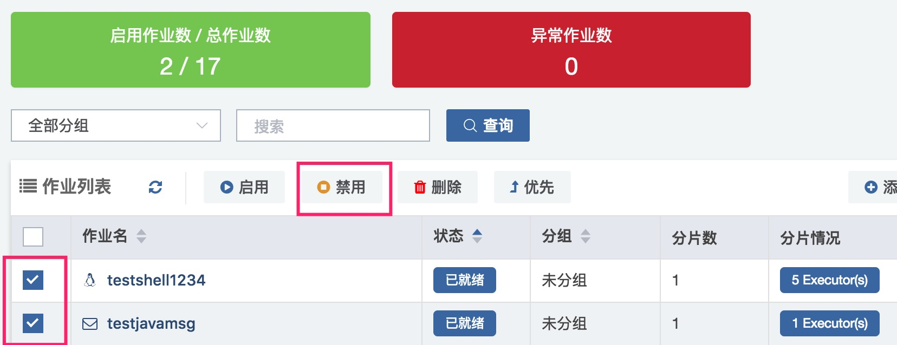

# 停止作业

当我们要停止一个作业，有两种方式：

- 在作业配置页面停止作业
- 在作业列表页面批量停止

### 在作业配置页面停止作业

直接点击右上角的“禁用”按钮

### 在作业总览页面批量停止

先批量选择你要停止的作业，然后点击“禁用作业”按钮

 

作业禁用后，可能出现两种状态：

- **已停止**：表示作业已经停止 
- **停止中**：表示作业正在运行中，运行完才停止

### **当我们需要立即终止正在处于停止中作业的时候，需要点击“立即终止作业”**

立即终止作业（即强杀) 会终止业务线程，如果业务的代码实现不能保证幂等性，则可能会导致一些影响业务的后果。

立即终止作业不支持批量操作。

点击后，Saturn Executor收到信号即会对业务线程进行强杀。正常情况下会进入STOPPED状态。

**但是，当业务代码存在不可中断的实现，例如socket.read()没有设置超时一直等待读的情况，就强杀不了。这种情况需要运维介入，重启Executor。**