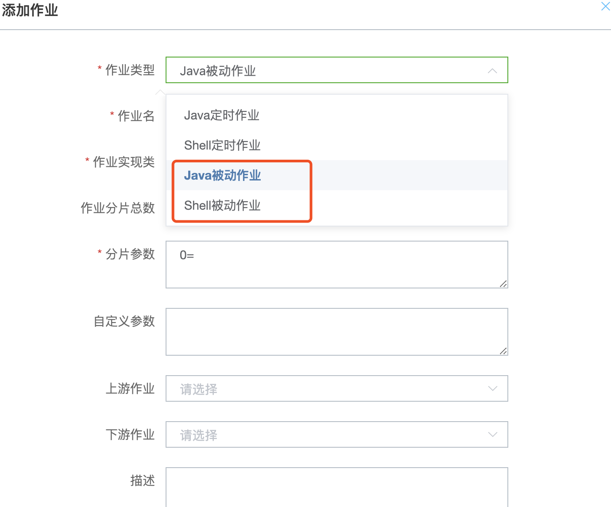
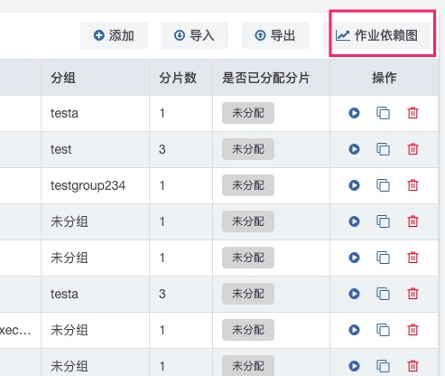
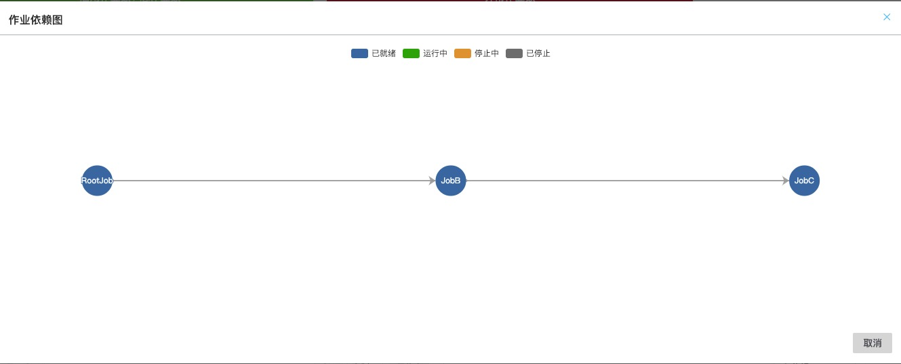

# 作业编排

> **该功能仅支持saturn 3.3.0及以上版本**

## 1 概述

有时候由于业务的需要，我们需要按照工作流的方式去调度作业：

​        **JobA**调度成功后调度 **JobB**, **JobB**调度成功后调度 **JobC**

Saturn提供这个能力，我们称之为作业编排。作业编排将作业形成一个有向无环图，按照图的顺序依次调用。

## 2 概念

在一个调用链路里面，有上游和下游的概念。以上面的例子为例，JobA是这个调用链路的最上游或者称之为root，JobB和JobC是root的下游。

最上游作业(root作业)可以是Java定时作业或者Shell定时作业。

下游作业的作业类型称之为`被动作业`。被动作业可以细分为`Java被动作业`和`Shell被动作业`。

3.3.0版本，整个调用链里面的作业的分片数只能是1，要求链路不能形成环。

## 3 接入步骤

### 3.1 开发作业

作业编排里面的所有作业（无论是root或者被动作业），都必须是Java定时作业或者Shell定时作业。关于Java定时作业和Shell定时作业的开发，请看相应章节，这里不做赘述。

### 3.2 在Console定义作业调用顺序

#### 3.2.1 定义Root作业

Root作业是一个Java定时作业或者Shell定时作业。详情参见`Java作业`的Console创建作业章节。

#### 3.2.2 定义下游作业（被动作业）

作业类型选择“Java被动作业”或者“Shell被动作业”，上游作业选择Root作业或者其他被动作业。

#### 3.2.3 查看调用依赖

在域作业总览页面，点击`作业依赖图`可以看到整个域的作业编排调用顺序。

