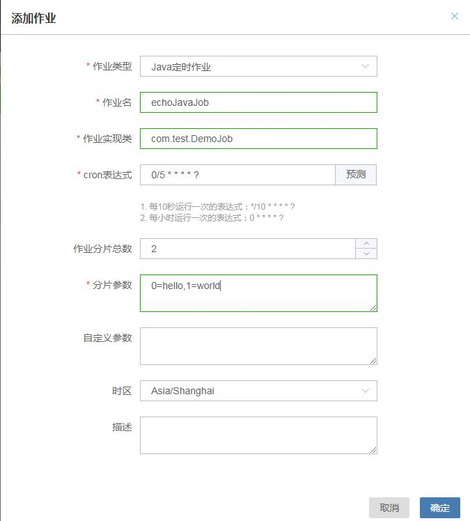
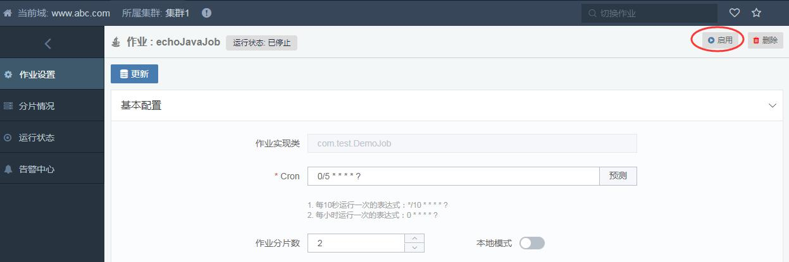
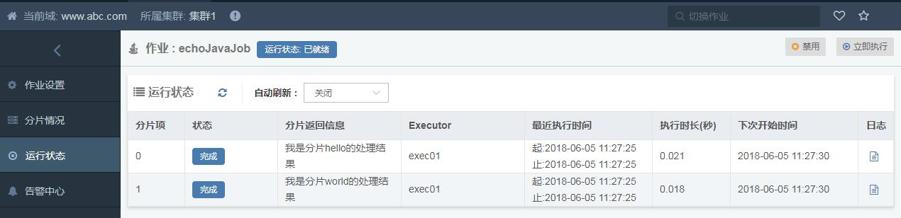
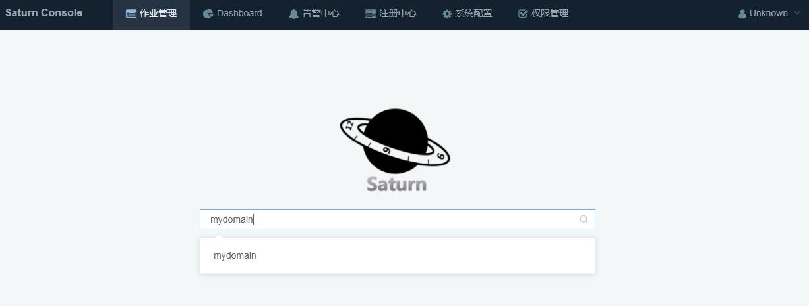
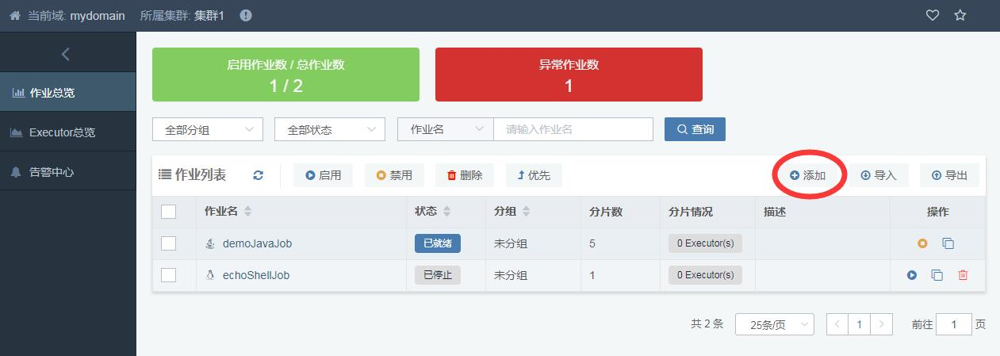
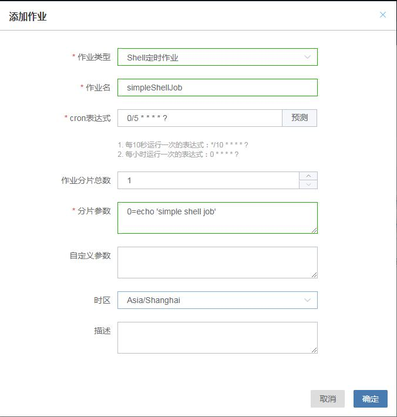
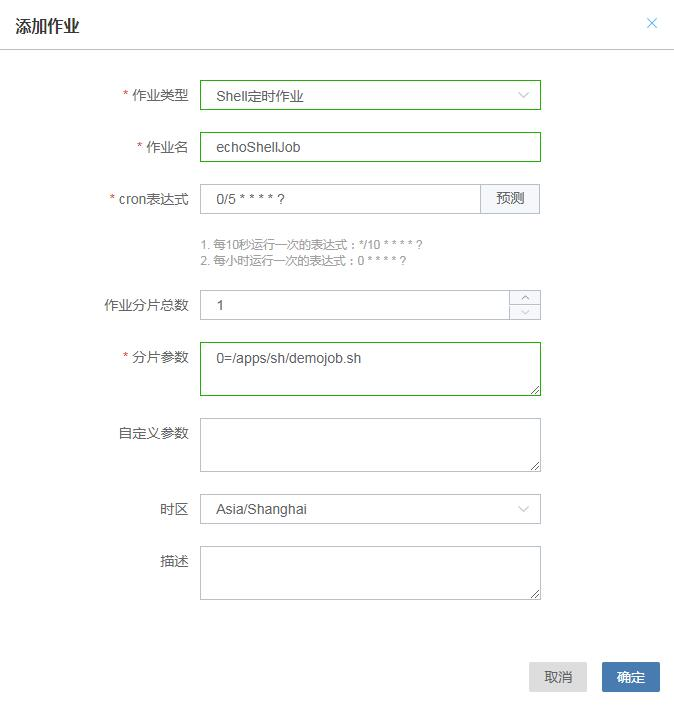
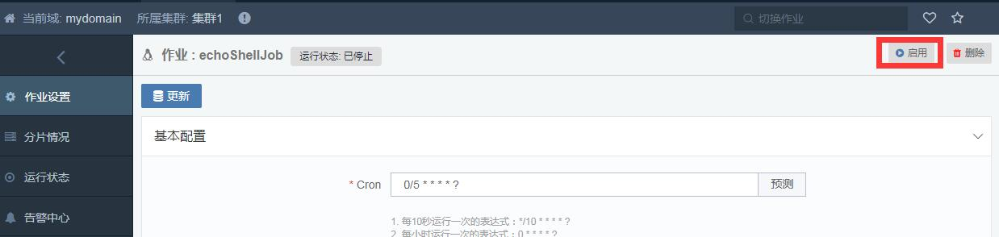

# 开发你的作业

这一节想介绍如何开发你的作业，包括Java和Shell两种类型，并使用你熟悉的IDE进行调试。

> 但要注意的是，作业开发完需要将其部署到Executor才能真正的工作。
>
> 关于如何部署，见“部署 Saturn Executor”一节。

## 0 前置条件

确保你已经部署好Saturn Console。如果没有，请参见“部署Saturn Console”一节。

## 1 开发Java作业

### 1.1 添加maven依赖

在pom.xml添加dependency

```xml
<dependency>
    <groupId>com.vip.saturn</groupId>
    <artifactId>saturn-job-api</artifactId>
    <!-- 修改成指定版本 -->
    <version>master-SNAPSHOT</version>
</dependency>  
```

以及plugin

```xml
<plugin>
  <groupId>com.vip.saturn</groupId>
  <artifactId>saturn-plugin</artifactId>
  <!-- 版本与saturn-job-api一致 -->
  <version>master-SNAPSHOT</version>
</plugin>
```

### 1.2 开发第一个Java作业 ###

修改现在类或者增加一个新的类，继承自**AbstractSaturnJavaJob** ，实现 *handleJavaJob*方法。

```java
    public class DemoJob extends AbstractSaturnJavaJob {

    	@Override
    	public SaturnJobReturn handleJavaJob(final String jobName, final Integer shardItem, final String shardParam, final SaturnJobExecutionContext context) {
    	// do what you want here ...
              
    	// 返回一个SaturnJobReturn对象，默认返回码是200表示正常的返回
            		return new SaturnJobReturn("我是分片"+shardItem+"的处理结果");
	    }
    }
```

handleJavaJob方法是作业调用主入口，当调度周期到达时，Saturn会调用该方法。

传入参数如下：

* jobName：作业名
* shardItem：分片编号（从0开始）分片参数（在Console配置)
* shardParam：分片参数（在Console配置）
* context：调用上下文

上面只是展示了如何写一个简单的作业，实际上的作业会复杂很多，**AbstractSaturnJavaJob**提供的一些工具方法或许会减少你的工作量。更多的**AbstractSaturnJavaJob** 的方法介绍可以看教程。

#### 关于JavaJobReturn

JavaJobReturn是作业结果返回的封装。里面三个成员变量，包括：

- returnCode: 结果码。0代表结果成功，其余值代表失败。默认为0。用户可以根据自己业务的情况设置返回值，但注意，如下返回码是保留字不能使用，包括：0，1，2，9999。
- returnMsg：返回信息。将显示在Console里面。没有默认值。
- errorGroup：异常码。详情参见教程。

### 1.3 在IDE中调试作业

这一步会在IDE启动一个Executor进程。

#### 1.3.1 Eclipse

点工程右键 -> Run/Debug As -> Run Configuration 


- namespace： 命名空间。命名空间用于对作业进行分组，作业必须属于某个命名空间，同一个命名空间下的作业名不能重复。
- executorName：执行结点唯一标识

#### 1.3.2 IntelliJ IDEA


添加启动参数:

saturn:run -Dnamespace=www.abc.com -DexecutorName=exec01 -DVIP_SATURN_CONSOLE_URI=http://127.0.0.1:9088

参数含义请参考3.1节

### 1.4 在Console添加Java作业

当IDE启动了Executor后，作业还是不能执行，直到在Console添加和启动相应的Java作业。

在Console添加一个Java作业，**作业实现类**必须是你所实现的Java作业的className。



* 作业类型： 分为Java定时作业和Shell定时作业，这里选择Java定时作业
* 作业名：作业ID标识，namespace下必须唯一
* 作业实现类：作业实现类的完整包名+类名
* cron表达式：作业定时表达式
* 作业分片总数：表示并发执行的数量，2代表该作业同时有两个进程在并发执行，每个进程都有自己专门的脚本和参数(这些进程可能同跑在不同机器上的)。
* 分片序列号/参数对照表：定义每个分片执行的完整脚本路径及参数。这是saturn最重要的参数之一。分片号从0开始，最大为分片总数-1。
* 作业描述信息 (*Optional*)：作业描述

更多高级的配置，可以在作业编辑页面进行编辑。

然后启动这个作业



如果一切正常会在IDE的console看到作业运行的日志，也可以在“分片”标签看到执行的结果。（当然，前提是作业到点执行了）

下面是执行成功看到的日志：

```
[2017-12-13 15:09:45.206] [INFO] [executor_001_echoJavaJob-saturnQuartz-worker] [com.vip.saturn.job.basic.AbstractSaturnJob] >>> [echoJavaJob] msg=Job echoJavaJob handle items: [0, 1]
[2017-12-13 15:09:45.206] [INFO] [Saturn-echoJavaJob-1-thread-1] [com.vip.saturn.job.java.SaturnJavaJob] >>> [echoJavaJob] msg=Running SaturnJavaJob,  jobClass is com.test.DemoJob 
[2017-12-13 15:09:45.207] [INFO] [Saturn-echoJavaJob-1-thread-3] [com.vip.saturn.job.java.SaturnJavaJob] >>> [echoJavaJob] msg=Running SaturnJavaJob,  jobClass is com.test.DemoJob 
[2017-12-13 15:09:45.207] [INFO] [executor_001_echoJavaJob-saturnQuartz-worker] [com.vip.saturn.job.basic.AbstractSaturnJob] >>> [echoJavaJob] msg=echoJavaJob finished, totalCost=1, return={0=SaturnJobReturn [returnCode=0, returnMsg=我是分片0的处理结果, errorGroup=200, prop={SATURN_TRACE_ID=4882587783541623202, SATURN_PARENT_SPAN_ID=1611817686233844130}], 1=SaturnJobReturn [returnCode=0, returnMsg=我是分片1的处理结果, errorGroup=200, prop={SATURN_TRACE_ID=4418419319829081425, SATURN_PARENT_SPAN_ID=3024241466322103633}]}
```

下面是Console看到的结果：



### 1.5 打包&部署 ###

如果上述步骤没有问题，则意味着作业在本地验证通过。现在可以进行部署了。

运行以下命令打包

```Shell
mvn saturn:zip
```

会在/target目录下得到**-app.zip**的一个压缩包，参照部署指引将压缩包部署到executor。

当你走完这一步，你的作业已经开发并调试完毕，请参见“部署Saturn Executor”一节，了解如何把打包好的作业部署到Executor运行。

## 2 开发Shell作业

Shell作业实际上不局限于Shell脚本，还可以是一切能在Executor所在服务器运行的脚本和程序，脚本/程序的开发语言不受限制，可以使Python/Java/PHP/Ruby …。

具体原理见下图。在满足调度条件时，Saturn Executor会调用System.exec()去调用脚本/程序。


### 2.1 开发第一个Shell作业

开发Shell作业有两种形式：

- 简易开发：直接在Saturn Console文本框中编写Shell脚本，无需在Executor放置脚本，该方法适合运行简易的脚本
- 脚本开发：把脚本/程序部署在特定路径上，然后在Saturn Console上配置脚本运行路径

根据实际需求选择任意一种方式新建Shell作业

#### 2.1.1 简易开发

首先通过首页进入默认域（或自定义域）


然后点击“添加”按钮添加新作业


接着添加Shell作业，在“分片参数”输入框中输入Shell脚本


最后点击“确定”保存

#### 2.1.2 脚本开发

您还可以选择脚本来开发Shell作业。

首先准备脚本，在/apps/sh目录下新建**demojob.sh**脚本，脚本内容：

```shell
#/bin/sh
echo "hello world"
```

然后给脚本新增可执行权限：

```shell
chmod +x /apps/sh/demojob.sh
```

脚本准备完后添加Shell作业



留意分片参数配置，参数的值是执行/apps/sh/demojob.sh脚本的命令。

最后点击“确定”保存。

### 2.2 启动Executor

Shell没办法像Java一样使用Maven插件去调试，我们需要下载并启动一个Executor标准包去验证我们刚开发好的脚本。详情参见[Saturn Executor部署指南](zh-cn/2.x/saturn-executor-deployment.md).

对于Shell作业，Executor的部署比Java作业要简单，只要下载并解压，执行脚本的启动命令即可。

### 2.3 启动作业

当Executor启动后，作业不会自动执行，直到在Saturn Console启动相应的Shell作业。



如果一切正常会在IDE的console看到作业运行的日志，也可以在“分片”标签看到执行的结果。（当然，前提是作业到点执行了）

下面是执行成功看到的日志：

```
[2017-12-13 17:17:25.119] [INFO] [Saturn-echoShellJob-2-thread-2] [com.vip.saturn.job.shell.ScriptJobRunner] >>> [echoShellJob] msg=echoShellJob-0: hello world

[2017-12-13 17:17:25.120] [INFO] [Saturn-echoShellJob-2-thread-2] [com.vip.saturn.venus.util.HemersCounter] >>> msg=reported event to herms, type:SATURN.EXECUTOR.FOR.NABOO, title:Job item stop, jobName is echoShellJob, item is 0, msg:executorName is executor_001, domain is yfb-saturn-executor.vip.vip.com
[2017-12-13 17:17:25.120] [INFO] [executor_001_echoShellJob-saturnQuartz-worker] [com.vip.saturn.job.basic.AbstractSaturnJob] >>> [echoShellJob] msg=echoShellJob finished, totalCost=24ms, return={0=SaturnJobReturn [returnCode=0, returnMsg=the exit value is 0, errorGroup=200, prop={}]}
```

下面是Console看到的结果：


至此，你的第一个Shell作业已经顺利开发完成！

## 3 集成Spring

从3.3.0版本开始支持该功能。

下载Demo工程 [saturn-demo-spring](https://github.com/vipshop/Saturn/tree/develop/examples/saturn-demo-spring)

### 3.2.1 依赖saturn-spring

```xml
<dependency>
    <groupId>com.vip.saturn</groupId>
    <artifactId>saturn-spring</artifactId>
    <!-- 修改成指定版本 -->
    <version>master-SNAPSHOT</version>
</dependency>
```

### 3.2.2 配置saturn.properties

在classpath根目录下添加`saturn.properties`文件，添加app.class配置。

```properties
app.class=com.vip.saturn.job.spring.GenericSpringSaturnApplication
```

`GenericSpringSaturnApplication`将使用`ClassPathXmlApplicationContext`，加载`applicationContext.xml`文件来启动Spring。

### 3.2.3 自定义启动Spring

- 您可以通过编写`GenericSpringSaturnApplication`的子类，重写其方法，并配置`app.class`为该类，来达到自定义启动Spring的目的。

- 如果您想自定义启动加载的xml文件，那么您可以重写`getConfigLocations()`方法。

- 如果您想完全自定义启动Spring，那么您可以重写`run()`方法。

## 4 集成SpringBoot

从3.3.0版本开始支持该功能。

下载Demo工程 [saturn-demo-springboot](https://github.com/vipshop/Saturn/tree/develop/examples/saturn-demo-springboot)

### 4.2.1 依赖saturn-springboot

```xml
<dependency>
    <groupId>com.vip.saturn</groupId>
    <artifactId>saturn-springboot</artifactId>
    <!-- 修改成指定版本 -->
    <version>master-SNAPSHOT</version>
</dependency>
```

### 4.2.2 配置saturn.properties

在classpath根目录下添加`saturn.properties`文件，添加app.class配置。

```properties
app.class=com.vip.saturn.job.springboot.GenericSpringBootSaturnApplication
```

`GenericSpringBootSaturnApplication`将使用`SpringApplication.run(source())`来启动SpringBoot。

### 4.2.3 自定义启动SpringBoot

- 您可以通过编写`GenericSpringBootSaturnApplication`的子类，重写其方法，并配置`app.class`为该类，来达到自定义启动SpringBoot的目的。

- 如果您想自定义启动加载的source，那么您可以重写`source()`方法。

- 如果您想完全自定义启动SpringBoot，那么您可以重写`run()`方法。

## 5 嵌入式使用Saturn（不建议）

<font color="red">
因为嵌入式使用Saturn，其打包方式、运行方式、运行jvm参数都依赖于工程的主框架（比如Spring、Tomcat等），造成Saturn ClassLoader不能与业务ClassLoader分离，从而带来的日志分离、包冲突等问题，而且导致Executor一键重启、自动升级等功能失效。所以，我们不建议使用嵌入式。
</font>

在此，介绍在Spring或SpringBoot环境中嵌入式使用Saturn，不再需要使用saturn-plugin插件，Saturn Executor的启动或停止依赖于Spring的启动或停止。

从3.3.0版本开始支持该功能。

下载Demo工程 [saturn-demo-springboot-embedded](https://github.com/vipshop/Saturn/tree/develop/examples/saturn-demo-springboot-embedded)

### 5.2.1 依赖saturn-embed-spring

```xml
<dependency>
    <groupId>com.vip.saturn</groupId>
    <artifactId>saturn-embed-spring</artifactId>
    <!-- 修改成指定版本 -->
    <version>master-SNAPSHOT</version>
</dependency>
```

### 5.2.2 注册EmbeddedSpringSaturnApplication

```java
@Bean
public EmbeddedSpringSaturnApplication embeddedSpringSaturnApplication() {
  EmbeddedSpringSaturnApplication embeddedSpringSaturnApplication = new EmbeddedSpringSaturnApplication();
  embeddedSpringSaturnApplication.setIgnoreExceptions(false);
  return embeddedSpringSaturnApplication;
}
```

以上例子是在SpringBoot环境中注册，如果Spring环境，您可以通过配置xml来注册该bean。

`EmbeddedSpringSaturnApplication`将监听Spring容器的`ContextRefreshedEvent`事件来启动Saturn Executor，监听`ContextClosedEvent`事件来优雅停止Saturn Executor。

其中，`setIgnoreExceptions()`方法，如果设置`true`，那么当启动或停止Executor时出现异常，将只打印Warn日志，不抛出异常，不影响Spring容器的运行；如果设置`false`，则不仅打印日志，而且会抛出异常，影响Spring容器的启动和停止。

