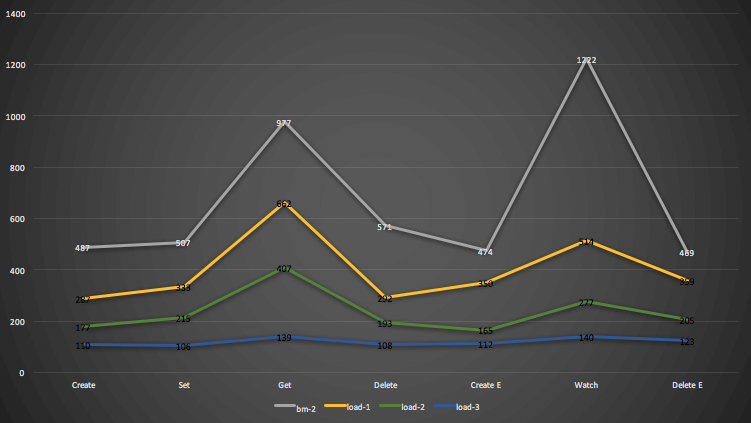
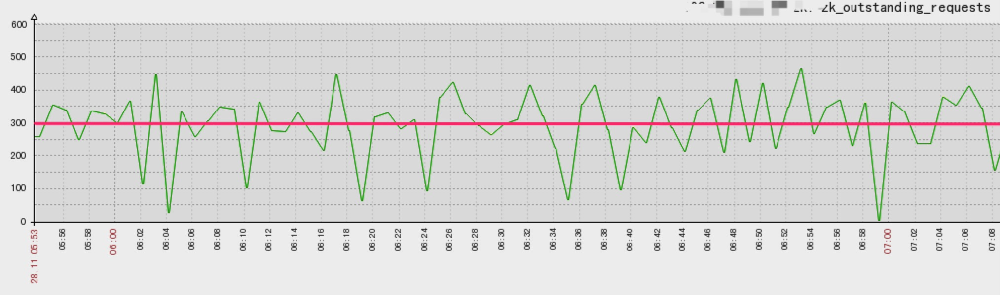
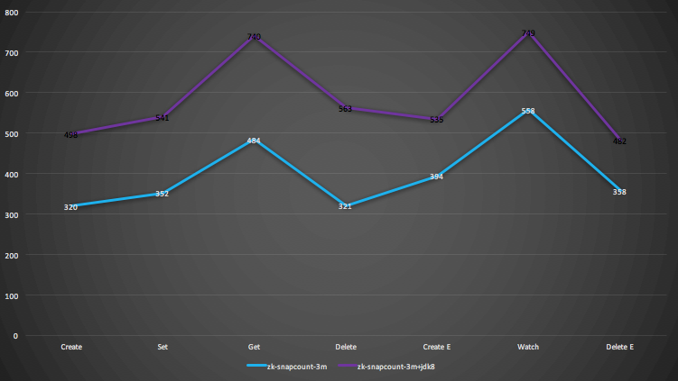

# Saturn性能测试报告

## 1. 测试目的

- 评估zk集群可以负荷的域数量
- zk参数调优

## 2. 测试环境

**ZooKeeper Ensemble (5)**

**Version: 3.4.6**

| server id | role                              | 配置                                       |
| --------- | --------------------------------- | ---------------------------------------- |
| 1         | Follower                          | CPU: 2200MHZ X 24RAM: 126G带宽：1000M OS：CentOS 6.6 |
| 2         | Follower                          | CPU: 2600MHZ X 24RAM: 31G带宽：2000M OS：CentOS 6.6 |
| 3         | Follower                          | CPU: 2601MHZ X 24RAM: 31G带宽：2000M OS：CentOS 6.6 |
| 4         | Leader 注：下面的每一组测试都会保证这台机器都是Leader | CPU: 1217MHZ X 24RAM: 126G带宽：2000M OS：CentOS 7.3 |
| 5         | Follower                          | CPU: 1217MHZ X 24RAM: 126G带宽：2000M OS：CentOS 6.6 |

 

**Saturn Console (2):**

**Version: 2.1.3**

| ID        | 配置                                       | 备注                                   |
| --------- | ---------------------------------------- | ------------------------------------ |
| console-1 | -Xms8g -Xmx8g -Xmn2g -Xss256k -XX:ParallelGCThreads=24 \-XX:+UseConcMarkSweepGC -XX:PermSize=256m -XX:MaxPermSize=256m \-DVIP_SATURN_DASHBOARD_REFRESH_INTERVAL_MINUTE=60 | 为了减少refresh对测试带来的噪音，refresh时间改为每小时1次 |
| console-2 | 同上                                       |                                      |

 

**Saturn Executor :**

**Version: 2.1.3**

- 嵌入式实现；
- 不打印日志；

## 3. 测试场景

### 3.1 测试模型

#### 3.1.1 变量定义

| 变量                   | 定义             | 是否变量 |
| -------------------- | -------------- | ---- |
| domainNum            | 域数             | Y    |
| executorNum          | executor总数量    |      |
| executorNumPerDomain | 每个域的executor数量 |      |
| jobNumPerDomain      | 每个域的作业数        |      |
| shardingItemPerJob   | 每个作业的分片数       |      |

#### 3.1.2 模型

- executorNumPerDomain = 3
- executorNum = executorNumPerDomain X domainNum = 3 X domainNum
- jobNumPerDomain = 35
- shardingItemPerJob = 3
- 作业调度频率：每分钟执行1次（时间随机）
- 作业类型：Shell
- 作业运行时长：2秒

### 3.2 场景

### 3.2.1 场景总览

- 场景1：（*Benchmark*）按照上述模型运行，获取benchmark。benchmark包括3个：没有任何作业下的性能（benchmark-0），200个域下的性能(benchmark-1)，400个域下的性能(benchmark-2)
- 场景2：（*最大负载*）通过增大域数量，其他参数保持不变，尝试获取集群的最大负荷；
- 场景3：（*参数调优*）在场景2的基础上，做zk配置调优；

### 3.2.2 具体测试用例

**场景1 - Benchmark**

| ID   | Name                         | 域数量  | Executor数量 | 作业数量  | 描述   |
| ---- | ---------------------------- | ---- | ---------- | ----- | ---- |
| bm-0 | (Benchmark-0) 0个域            | 0    | 0          | 0     |      |
| bm-1 | (Benchmark-1) 200个域，600exec  | 200  | 600        | 7000  |      |
| bm-2 | (Benchmark-2) 400个域，1200exec | 400  | 1200       | 14000 |      |

**场景2 - 最大负载**

| ID     | Name | 域数量  | Executor数量 | 作业数量 | 描述                    |
| ------ | ---- | ---- | ---------- | ---- | --------------------- |
| load-n |      |      |            |      | 每次添加100个域，进行压测，直到达到瓶颈 |

**场景3 - 参数调优**

| ID   | Name                   | 域数量     | Executor数量  | 作业数量         | 描述   |
| ---- | ---------------------- | ------- | ----------- | ------------ | ---- |
| zk-x | zookeeper.snapCount 调整 | 最大能承载域数 | 最大能承载域数 X 3 | 最大能承载域数 X 35 |      |
| zk-y | JDK 8                  | 最大能承载域数 | 最大能承载域数 X 3 | 最大能承载域数 X 35 |      |

## 4.测试方法 

使用[zk-smoketest](https://github.com/phunt/zk-smoketest)的zk-latencies.py进行benchmark获取。

zk-latencies是一个比较通用的zk benchmark工具，由zookeeper的作者之一Patrick Hunt开发。

zk-latencies.py会用1个zk client执行下列的操作：

- Create: 创建持久节点
- Set: 更新节点数据
- Get: 获取节点数据
- Delete: 删除持久节点
- Create Ephemeral: 创建临时节点
- Watch: 使用exsits()对节点设置watch
- Delete Ephemeral: 删除临时节点

测试中所使用的zk-latencies 参数：

```Shell
PYTHONPATH=lib.linux-x86_64-2.6 LD_LIBRARY_PATH=lib.linux-x86_64-2.6 ./zk-latencies.py \
--servers "<zk_cluster_ip>" \
--znode_count=100000 --znode_size=100 --synchronous
```

上述指令解释：调用同步接口分别调用5台zk server，获取benchmark。操作过程中所创建的节点大小固定为100bytes，操作的数量为100,000次。

## 5. 测试结果

为了便于比较，下面结果仅展现zk leader的结果。

### 5.1 场景1 - benchmark

#### 5.1.1 zk 参数

**JVM**

```Shell
-Djute.maxbuffer=104857600 \
-Xms6g -Xmx6g -Xmn1500m -XX:+UseConcMarkSweepGC -XX:+UseCMSInitiatingOccupancyOnly -XX:CMSInitiatingOccupancyFraction=75 \
-XX:+ExplicitGCInvokesConcurrent -Xloggc:/dev/shm/gc_zk.log -XX:+PrintGCDetails -XX:+PrintGCDateStamps -XX:ErrorFile=<your_log_dir> \ 
-XX:+HeapDumpOnOutOfMemoryError -XX:HeapDumpPath=<your_log_dir> \
-Dcom.sun.management.jmxremote -Dcom.sun.management.jmxremote.authenticate=false \
-Dcom.sun.management.jmxremote.ssl=false -Dcom.sun.management.jmxremote.port=8989 Djava.rmi.server.hostname=<zkip> \
org.apache.zookeeper.server.quorum.QuorumPeerMain
```

其中，JDK版本为**1.7.0_79**

**zoo.cfg**

```Shell
# The number of milliseconds of each tick
tickTime=2000
# The number of ticks that the initial
# synchronization phase can take
initLimit=10
# The number of ticks that can pass between
# sending a request and getting an acknowledgement
syncLimit=5
# the directory where the snapshot is stored.
# do not use /tmp for storage, /tmp here is just
# example sakes.
dataDir=<your_dir>
dataLogDir=<your_dir>
# the port at which the clients will connect
clientPort=2181
# the maximum number of client connections.
# increase this if you need to handle more clients
maxClientCnxns=1000
minSessionTimeout=4000
maxSessionTimeout=60000
#
# Be sure to read the maintenance section of the
# administrator guide before turning on autopurge.
#
# http://zookeeper.apache.org/doc/current/zookeeperAdmin.html#sc_maintenance
#
# The number of snapshots to retain in dataDir
autopurge.snapRetainCount=10
# Purge task interval in hours
# Set to "0" to disable auto purge feature
autopurge.purgeInterval=2

```


#### 5.1.2 结果

**zk数据**

| ID          | znode   | watchers | live connections | snapshot大小 | snapshot落盘时间间隔 | CPU of Leader (%) | Memory of Leader (GB) | Network In of Leader (MB/s) | Network Out of Leader (MB/s) | Disk Read of Leader (KB/s) | Disk Write of Leader (MB/s) |
| ----------- | ------- | -------- | ---------------- | ---------- | -------------- | ----------------- | --------------------- | --------------------------- | ---------------------------- | -------------------------- | --------------------------- |
| bm-0  0个域   | N/A     | N/A      | N/A              | N/A        | N/A            | 0.3               | 6.7                   | 0                           | 0                            | 0                          | 0                           |
| bm-1  200个域 | 581601  | 1485015  | 1810             | 59M        | 1min           | 4.37              | 10.8                  | 1.73                        | 2.73                         | 0                          | 5.89                        |
| bm-2  400个域 | 2392138 | 5859763  | 2448             | 115M       | 15s            | 9                 | 10.87                 | 3.6                         | 6.1                          | 0                          | 13                          |

**TPS**

| Operation        | bm-0 | bm-1 | bm-2 |
| ---------------- | ---- | ---- | ---- |
| Create           | 1354 | 1383 | 487  |
| Set              | 1385 | 1486 | 507  |
| Get              | 4234 | 3219 | 977  |
| Delete           | 1488 | 1568 | 571  |
| Create Ephemeral | 1266 | 1429 | 474  |
| Watch            | 4230 | 3174 | 1222 |
| Delete Ephemeral | 1272 | 1448 | 469  |

- 上述每个操作都是执行100,000次获取的平均值；

**TPS对比图**


#### 5.1.3 分析

当域的数量为200时，写性能没有下降，而读性能下降明显（~24%）；

当域的数量为400时，读写下降明显（>60%）。

### 5.2 场景2 - 最大负荷

#### 5.2.1 zk 参数

与5.1.1一致

#### 5.2.2 结果

**zk数据**

| ID            | znode   | watchers | live connections | snapshot大小 | snapshot落盘时间 | Avg. Outstanding Request | CPU of Leader (%) | Memory of Leader (GB) | Network In of Leader (MB/s) | Network Out of Leader (MB/s) | Disk Read of Leader (KB/s) | Disk Write of Leader (MB/s) |
| ------------- | ------- | -------- | ---------------- | ---------- | ------------ | ------------------------ | ----------------- | --------------------- | --------------------------- | ---------------------------- | -------------------------- | --------------------------- |
| load-1  500个域 | 2612650 | 6434186  | 3213             | 352M       | 15秒          | 106                      | 16                | 14.1                  | 3.65                        | 6.46                         | 1.19                       | 31.57                       |
| load-2  600个域 | 2831398 | 7005540  | 3613             | 381M       | 15秒          | 189                      | 16                | 14.1                  | 3.83                        | 6.79                         | 1.52                       | 33.04                       |
| load-3  700个域 | 3051027 | 7574432  | 4314             | 409M       | 15秒          | 293                      | 17.5              | 14.1                  | 4.12                        | 7.33                         | 1.73                       | 35.12                       |

**TPS**

| Operation        | load-1 | load-2 | load-3 |
| ---------------- | ------ | ------ | ------ |
| Create           | 287    | 177    | 110    |
| Set              | 333    | 215    | 106    |
| Get              | 662    | 407    | 139    |
| Delete           | 292    | 193    | 108    |
| Create Ephemeral | 350    | 165    | 112    |
| Watch            | 514    | 277    | 140    |
| Delete Ephemeral | 359    | 205    | 123    |

TPS对比图




Outstanding Size分布图



#### 5.2.3 分析

- 700个域后，已经无法添加多100个域的作业。因此，700个域是当前测试配置下的最大负荷；
- 当zk的outstanding**长期处于300**以上，zk集群开始出现不稳定（见上图）

### 5.3 场景3 - 参数优化

#### 5.3.1 Snapcount 调整

ZK会定时备份snapshot，而snapcount这个配置项影响了zk的落盘频率。下面这组测试是观察snapcount的大小（snapshot落盘频率）跟性能的关系。

#### 5.3.1.1 zk 参数

在5.1.1描述的配置基础上，添加了-Dzookeeper.snapcount=xxx 参数，具体数值见下

#### **5.3.1.2 结果**

**zk数据**

| ID               | 描述                                  | snapshot大小 | snapshot落盘时间 | CPU of Leader (%) | Memory of Leader (GB) | Network In of Leader (MB/s) | Network Out of Leader (MB/s) | Disk Read of Leader (KB/s) | Disk Write of Leader (MB/s) |
| ---------------- | ----------------------------------- | ---------- | ------------ | ----------------- | --------------------- | --------------------------- | ---------------------------- | -------------------------- | --------------------------- |
| zk-snapcount-1m  | 700个域，zookeeperSnapcount=1,000,000  | 408M       | 2分钟          | 20                | 12.15                 | 5.75                        | 10.33                        | 0                          | 23.65                       |
| zk-snapcount-3m  | 700个域，zookeeperSnapcount=3,000,000  | 410M       | 5分钟          | 15                | 10.69                 | 6.9                         | 13.9                         | 0                          | 16                          |
| zk-snapcount-10m | 700个域，zookeeperSnapcount=10,000,000 | 410M       | 16分钟         | 18                | 11.73                 | 5.8                         | 10.32                        | 0                          | 20                          |

**TPS**

| Operation        | zk-snapcount-1m | zk-snapcount-3m | zk-snapcount-10m |
| ---------------- | --------------- | --------------- | ---------------- |
| Create           | 200             | 320             | 409              |
| Set              | 201             | 352             | 473              |
| Get              | 256             | 484             | 688              |
| Delete           | 232             | 321             | 451              |
| Create Ephemeral | 215             | 394             | 396              |
| Watch            | 292             | 558             | 665              |
| Delete Ephemeral | 173             | 358             | 413              |

TPS对比图


#### 5.3.1.3 分析

- 随着snapcount的增大，读写性能有所提高；
- snapcount=10m从效果来看最佳，但是CreateEphemeral的性能跟snapcount=3m差不多；因此，后续测试还是沿用snapcount=3m进行

#### 5.3.2 JDK调整

下面这组测试，是观察JDK不同版本对ZK性能的影响。

#### 5.3.2.1 zk 参数

在5.1.1描述的配置基础上添加了-Dzookeeper.snapcount=3000000，以及修改了JDK版本为“1.8.0_102”

#### 5.3.2.2 结果

**zk数据**

| ID                   | CPU of Leader (%) | Memory of Leader (GB) | Network In of Leader (MB/s) | Network Out of Leader (MB/s) | Disk Read of Leader (KB/s) | Disk Write of Leader (MB/s) |
| -------------------- | ----------------- | --------------------- | --------------------------- | ---------------------------- | -------------------------- | --------------------------- |
| zk-snapcount-3m+jdk8 | 18                | 12.1                  | 5.66                        | 10.11                        | 0                          | 21                          |

**TPS**

| Operation        | zk-snapcount-3m+jdk8 |
| ---------------- | -------------------- |
| Create           | 498                  |
| Set              | 541                  |
| Get              | 740                  |
| Delete           | 563                  |
| Create Ephemeral | 535                  |
| Watch            | 749                  |
| Delete Ephemeral | 482                  |

TPS对比图




#### 5.3.2.3 分析

- 使用了JDK8后性能有明显提升。(JDK8其中一个优化点是对Atomic相关类的优化，而ZK的实现使用了大量的Atomic，详情可以参考[这里](https://yuzhouwan.com/posts/31915/))

## 6. 总结

- 本次测试获取了2个benchmark：测试模型下的200个域以及400域的性能；
- 按照测试模型，最多能承受700个域；
- 使用JDK8以及调整snapcount到合适的值有助于改善性能；

